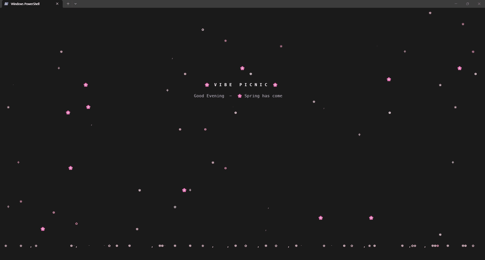
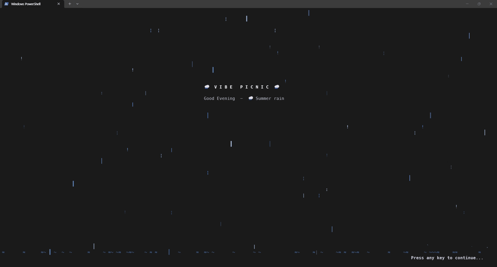
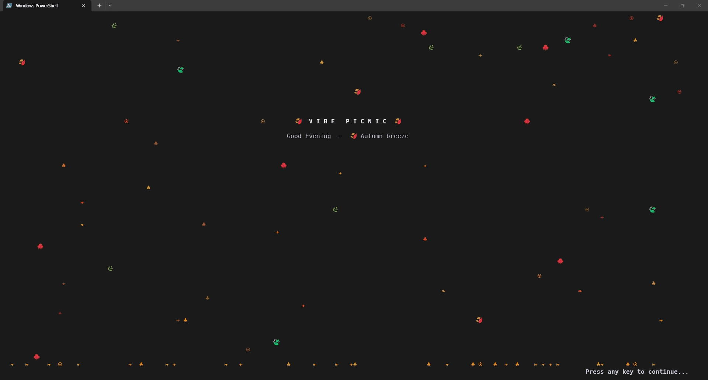
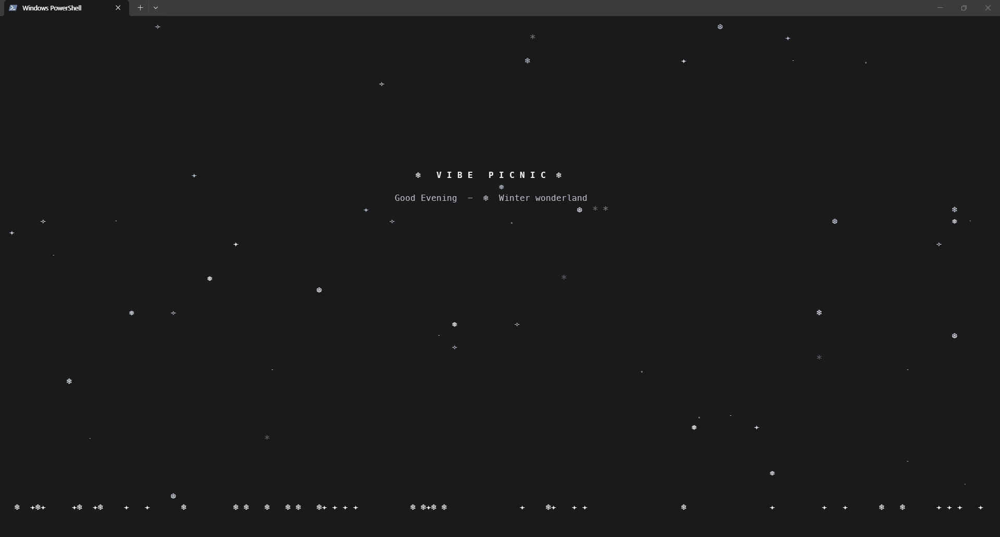
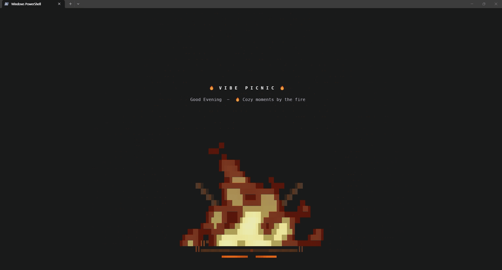

🇰🇷 한국어 | 🇺🇸 [English](./README.md)

# 🌕 Vibe Picnic

터미널에 개발자 감성을 담은 CLI 애니메이션 도구입니다. 터미널 분위기를 전환해주는 아트 도구로, 설정에 따라서 아스키 아트 효과와 특별한 장면들을 제공합니다.

```text
🌸 봄 - 벚꽃    🌧️ 여름 - 비    🍂 가을 - 낙엽    ❄️ 겨울 - 눈
🌕 호숫가 달빛   🔥 모닥불   🎆 폭죽놀이
```


---

## 🚀 설치 및 실행

### 로컬 빌드 및 실행
```bash
git clone https://github.com/kobong8/VibePicnic.git
cd VibePicnic
npm install
npm run build
npm start
# 혹은
npm run dev
```

### 글로벌 명령어로 등록 (어디서든 `vibe-picnic` 사용)
```bash
npm run build
npm link

# 이후 어디서든 실행 가능
vibe-picnic
vibe-picnic --season moonlake
vp --season campfire    # 단축 명령어
vp --season fireworks   # 현실적인 야간 폭죽 장면
```

### ✨ 터미널 시작 스플래시 설정

터미널을 열 때마다 자동으로 감성적인 애니메이션을 감상할 수 있습니다. 아무 키나 누르면 즉시 쉘이 시작됩니다.

설정 파일 맨 아래에 `vibe-picnic --splash`를 추가하세요.

- **Bash:** `~/.bashrc`
- **Zsh:** `~/.zshrc`
- **Fish:** `~/.config/fish/config.fish`
- **PowerShell:** `$PROFILE` (`echo $PROFILE`로 경로 확인)

> **Oh My Posh 사용자 (PowerShell):**
> `$PROFILE`에서 Oh My Posh 초기화 코드 위쪽에 추가하여 사용하시면 됩니다.
> ```powershell
> vibe-picnic --splash
> oh-my-posh init pwsh --config 'your-theme.omp.json' | Invoke-Expression
> ```

---

## 🗑️ 삭제 방법

### 1. 글로벌 패키지 제거

먼저 등록된 패키지명을 확인합니다.
```bash
npm ls -g --depth=0
```

확인한 패키지명으로 제거합니다.
```bash
npm uninstall -g vibe-picnic
```

> `npm link`로 등록한 경우 프로젝트 폴더에서 `npm unlink`를 실행해도 됩니다.
> ```bash
> cd VibePicnic
> npm unlink
> ```

### 2. 터미널 시작 설정 제거

shell 설정 파일에서 `vibe-picnic` 관련 줄을 삭제합니다.

- **Bash:** `~/.bashrc`
- **Zsh:** `~/.zshrc`
- **Fish:** `~/.config/fish/config.fish`
- **PowerShell:** `$PROFILE` (`echo $PROFILE`로 경로 확인)

```bash
# 아래 줄을 찾아서 삭제
vibe-picnic --splash
```

변경 사항을 즉시 반영하려면 설정 파일을 다시 불러옵니다.
```bash
source ~/.zshrc   # Bash는 source ~/.bashrc
```

### 3. 설정 파일 제거 (선택)
```bash
rm ~/.vibe-picnic.json
```

---

## 💡 실행화면

(실행화면은 예시로 보시는 것보다 예쁩니다. 특히 모닥불은 색이 다 안담겼어요 ㅠ)

#### 🌸 봄 (spring)



#### 🌧️ 여름 (summer)



#### 🍂 가을 (autumn)



#### ❄️ 겨울 (winter)



#### 🌕 달빛 호숫가 (moonlake)


#### 🔥 모닥불 (campfire)



#### 🎆 폭죽놀이 (fireworks)

`fireworks` 테마는 별밤에 펼쳐지는 아름다운 불꽃놀이 입니다.

예시는 추가 예정입니다.

---

## 🎨 테마 및 장면

`vibe-picnic`은 현재 월(Month)에 맞춰 계절을 자동으로 감지하거나, 사용자가 직접 테마를 선택할 수 있습니다.

### 계절 파티클 테마
| 키 | 테마명 | 설명 |
|:---:|:---:|---|
| `1` | `spring` | 🌸 벚꽃이 흩날리는 따뜻한 봄 |
| `2` | `summer` | 🌧️ 시원한 빗줄기와 물방울이 튀는 여름 |
| `3` | `autumn` | 🍂 낙엽이 고요하게 떨어지는 가을 |
| `4` | `winter` | ❄️ 하얀 눈이 소복이 쌓이는 겨울 |

### 특정 장면 테마
| 키 | 테마명 | 설명 |
|:---:|:---:|---|
| `5` | `moonlake` | 🌕 호숫가 위 큰 달과 수면에 비치는 달빛, 반짝이는 별 |
| `6` | `campfire` | 🔥 타오르는 장작과 불꽃 애니메이션, 따뜻한 모닥불 |
| `7` | `fireworks` | 🎆 별밤에 펼쳐지는 아름다운 불꽃놀이 |

---

## 🛠️ 옵션 및 조작

### CLI 옵션
| 옵션 | 설명 | 기본값 |
|---|---|:---:|
| `--season <name>` | 테마 선택 (`spring`, `summer`, `autumn`, `winter`, `moonlake`, `campfire`, `fireworks`, `auto`, `random`) | `auto` |
| `--density <n>` | 파티클 밀도 (1-50) | `15` |
| `--speed <n>` | 애니메이션 속도 배율 (0.1-5.0) | `1.0` |
| `--wind <n>` | 바람의 세기와 방향 (-5.0 ~ 5.0) | `0.5` |
| `--splash` | 스플래시 모드 (아무 키나 누르면 종료) | `off` |
| `--message <text>` | 스플래시 화면에 표시할 커스텀 메시지 | - |
| `--ascii` | ASCII 문자만 사용하여 렌더링 | `off` |
| `--no-color` | 색상 효과 비활성화 | `off` |
| `--no-ground` | 바닥에 파티클이 쌓이는 효과 비활성화 | `off` |

### 실시간 조작 키
| 키 | 동작 설명 |
|:---:|---|
| `1` ~ `7` | 즉시 테마 전환 |
| `↑` `↓` | 파티클 밀도 조절 |
| `←` `→` | 바람의 방향 및 세기 조절 |
| `r` | 쌓인 바닥 리셋 |
| `q` / `ESC` | 프로그램 종료 |

---

## ⚙️ 설정 관리 (Persistent Configuration)

매번 옵션을 입력하지 않아도 되도록 기본 설정을 영구적으로 저장할 수 있습니다. 설정은 사용자 홈 디렉토리의 `.vibe-picnic.json` 파일에 저장됩니다.

```bash
# 현재 설정 확인 (✏️ 표시가 직접 설정한 값)
vibe-picnic config show

# 예시 : 기본 테마를 모닥불로 변경
vibe-picnic config set season campfire

# 파티클 밀도 변경
vibe-picnic config set density 30

# 더 풍성한 폭죽 설정 예시
vibe-picnic config set density 24
vibe-picnic config set speed 1.2

# ASCII 모드 활성화 (이모지 대신 문자 사용)
vibe-picnic config set ascii true

# 설정 초기화 (기본값으로 복구)
vibe-picnic config reset

# 설정 파일 위치 확인
vibe-picnic config path    # 예: ~/.vibe-picnic.json
```

---

## 📅 자동 계절 감지 (Auto Mode)

`--season auto` (기본값) 사용 시, 시스템 월(Month) 정보를 바탕으로 테마가 선택됩니다.

| 월 | 선택 테마 |
|:---:|:---:|
| 3월 - 5월 | 봄 (spring) |
| 6월 - 8월 | 여름 (summer) |
| 9월 - 11월 | 가을 (autumn) |
| 12월 - 2월 | 겨울 (winter) |

---

## 🎲 랜덤 테마 (Random Mode)

`--season random` 사용 시, 실행할 때마다 7가지 테마 중 하나가 무작위로 선택됩니다.

```bash
# 한 번만 랜덤
vibe-picnic --season random

# 기본 설정을 랜덤으로
vibe-picnic config set season random
```

터미널 시작 스플래시와 함께 사용하면 매번 다른 테마로 터미널이 열립니다.

```bash
# ~/.zshrc 또는 ~/.bashrc 에 추가
vibe-picnic --splash --season random
```

---

## 📋 요구사항 및 라이선스

- **Node.js:** >= 14.0.0
- **Dependencies:** 외부 의존성 없음 (Zero-dependency)
- **License:** MIT
